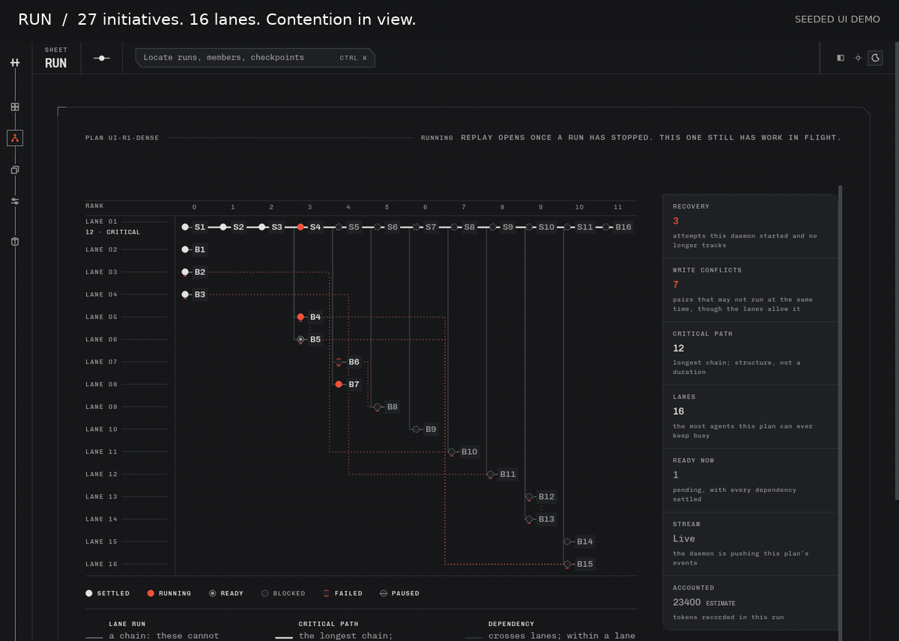

# Herdsman

**Local orchestration for agentic engineering.**

Turn a brief into a dependency graph, assign initiatives to your AI coding agent CLIs and models, and run independent work in parallel. Herdsman gives each attempt an isolated worktree, carries evidence between roles, and lets you review handoffs before dependent work proceeds.

The pipeline is yours: roles, contracts, model assignments, and approval gates. Agents work in terminal panes; you supervise and review from a browser or the CLI. Configuration stays in your project—Herdsman never edits global harness settings.

[Try the UI](#try-the-ui-from-source) · [Run real agents](#running-real-agents) · [CLI reference](docs/cli.md) · [Architecture](docs/architecture-boundaries.md)



*29 seconds: the dense Run contention field, Ctrl+K search and navigation, Library assets, Kitchen harnesses and models, and Map architecture and tours. Recorded against the real daemon with seeded plans and example assignments; Map reads Herdsman’s Python source. No live agent execution or benchmark is implied.*

> [!NOTE]
> Herdsman is local and pre-1.0. The daemon, CLI, and five browser views are implemented; APIs and workflows are still evolving. Full checkpoint content comparison and some operator flows remain unfinished. See [what’s next](#whats-next).

## Coordinate the work, inspect the evidence

- **Parallel work with explicit dependencies.** Approve a plan, run ready initiatives concurrently in `herdr` worktrees and panes, and see critical paths, file contention, and blocked consumers.
- **Handoffs with contracts.** Inspect checkpoint versions, changed paths, check results, and downstream impact. Gate dependent work on approved evidence; retain the history when an approval is withdrawn.
- **Control when a run changes course.** Retry, redirect, reassign, or nudge an initiative. Pause and recover runs, propose revisions to unfinished work, and replay recorded state.
- **Context and cost you can inspect.** Read task packets and their token costs, track spend and budgets, and inspect evidence-backed memory. Routine coordination and CLI queries require no model calls.
- **Your harnesses, your model assignments.** Discover local harnesses, inspect readiness, configure models, defaults, and fallbacks in Kitchen, and explicitly trigger model-consuming smoke tests.
- **Reusable engineering assets.** Browse roles, contracts, skills, agents, and checkpoint templates in Library. Inspect references and frozen plan assets; customize bundled assets with project-local overrides.
- **A scriptable control plane.** The browser and CLI share the daemon API. Use JSON, NDJSON, or text output, stable exit codes, stdin briefs, ID prefixes, attention queries, and waits in your own workflows.

## Five views of the same project

| View | What you do there |
| --- | --- |
| **Home** | Survey the fleet, see which runs need attention, and open a run. |
| **Run** | Follow the dependency graph; inspect initiatives, checkpoints, packets, spend, recovery, revisions, and replay. |
| **Kitchen** | Inspect harness health, configure model assignments and fallbacks, and test setup. |
| **Library** | Read reusable assets, follow references, and compare the shelf with a plan’s frozen set. |
| **Map** | Explore Python repository structure through source-linked maps, tours, flows, and symbol reads. |

The redesigned UI keeps the main graph or register in view while details open in an adjustable reading panel. Light and dark themes, a keyboard locator, and direct links help you move between the fleet and the work that needs you.

Map and the offline `herdsman nav` CLI use structural Python analysis and PEP 621 entry points. Dynamic and unresolved edges stay labeled; named flows are repository-curated. They do not promise a complete, type-inferred call graph.

## Try the UI from source

Requires Python **3.14+**, [`uv`](https://docs.astral.sh/uv/), and Node.js **22.12+** with npm. This preview needs **no agent credentials, model calls, or running herdr server**.

```sh
git clone --branch uat https://github.com/mitaash96/herdsman.git
cd herdsman
uv sync --locked
(cd ui && npm ci && npm run build)          # source checkout only
uv run python ui/dev/seed_plan.py --shape dense
uv run herdsman serve                        # http://127.0.0.1:8000
```

Open **<http://127.0.0.1:8000/run?plan=ui-r1-dense>** to explore 27 initiatives across 16 lanes, with dependencies and file contention. Press **Ctrl+K**, search for `B6`, and use the arrow keys and Enter to jump to the failed initiative. Use the reading panel’s width controls for a closer look. `npm run dev` is only needed for hot reload while editing the UI; it runs Vite separately on port 5173.

Start the daemon anywhere inside an initialized project; the CLI discovers the nearest `.herdsman/` directory. Use `-C/--project` to select one explicitly. Direct Run links use `?plan=<id>`; Home also provides fleet navigation. Seeded pane references are illustrative; runtime actions require real agents.

See the [CLI automation contract](docs/cli.md) for output, exit codes, waits, completions, and CLI/API parity. See [UI development](ui/README.md) for fixtures, capture commands, proxy configuration, and UI checks. The running daemon exposes its API documentation at <http://127.0.0.1:8000/docs>.

## Install

Herdsman requires Python **3.14+**, [`uv`](https://docs.astral.sh/uv/), and the external **herdr 0.9.1** CLI (private protocol 22). Install herdr through its distribution channel, start its local server, and verify the version before installing Herdsman:

```sh
herdr --version                         # must report 0.9.1
herdr status
```

A release wheel contains the Python daemon, bundled Markdown assets, and (when built) the browser UI. From a source checkout, build the UI and then the wheel; the Python build does not install Node tooling or compile the UI:

```sh
cd ui && npm ci && npm run build && cd ..
uv build --wheel
uv tool install dist/herdsman-0.0.1-py3-none-any.whl
```

Replace the wheel filename with the one in `dist/` if the project version changes. Building without `ui/build` is supported and produces an API-only wheel; bundled Markdown assets are still included. The wheel install and UI build path are also documented in [First run](docs/first-run.md).

After project-local harness/model setup, `herdsman demo` creates the bundled three-initiative graph: D1 and D2 run in parallel, require checkpoint approval, and only then release D3. Run `herdsman demo --help` for the timeout and port options.

Read [Recovery](docs/recovery.md) before a long run and [Architecture boundaries](docs/architecture-boundaries.md) for what Herdsman, herdr, the daemon, and the browser each own.

## Running real agents

Real execution additionally needs the pinned `herdr 0.9.1` CLI/server and authenticated agent CLIs. Start herdr, then declare adapters and model assignments in project-local `.herdsman/kitchen.json`; planning and execution can use different models on the same harness.

<details>
<summary>Example: one harness, two model assignments</summary>

Replace the placeholder model names with models available to your installed `pi` CLI. This is a configuration example, not a turnkey setup.

```json
{
  "version": 1,
  "adapters": [
    {"name": "pi", "argv": ["pi", "--print", "{prompt}"], "model_argv": ["--model"]}
  ],
  "models": [
    {"harness": "pi", "model": "frontier-model"},
    {"harness": "pi", "model": "cheap-model"}
  ],
  "tiers": {"pi/frontier-model": "frontier", "pi/cheap-model": "cheap"},
  "defaults": {
    "planner": {"harness": "pi", "model": "frontier-model"},
    "initiative": {"harness": "pi", "model": "cheap-model"}
  }
}
```

`GET /kitchen` reports configuration and readiness; `POST /kitchen/discovery` performs read-only harness health/version checks. `PUT /kitchen` requires the current `expect_revision` to prevent stale updates.

</details>

Use `herdsman create`, `review`, `approve`, and `run-plan` for the plan lifecycle; `herdsman attention`, `wait`, and `config` cover headless automation. Inspect each command's `--help` before dispatch.

## Reproduce the overhead evaluation

Run from a clean Git checkout with project-local Kitchen declarations, authenticated harness CLIs, and a live `herdr 0.9.1` server. Replace the example assignments with configured harness/model pairs; using a different second pair exercises the assignment variant.

```sh
uv run python -m herdsman.eval \
  --project-root . \
  --harness pi --model PRIMARY_MODEL \
  --assignment-harness pi --assignment-model SECOND_MODEL
```

The command runs the same tiny standard-library task as single-agent, parallel DAG, and assignment variants. It prints the exact reproduction command plus JSON containing pass rate, wall time, productive and orchestration tokens, provenance, receipt type, overhead ratio, and whether every variant met the 20% target. Only `receipt: "measured"` output from this live path is publishable; the deterministic test double is not a benchmark.

**Measured receipt:** none recorded yet. The 2026-09-19 attempt failed before producing a receipt: the reference variant's attempt did not settle, and the harness under test then exhausted its provider quota. No fixture number is substituted.

The [2026-09-20 release verification](docs/release-verification.md) records the
passing wheel smoke and the partial real demo, including the remaining global
configuration and end-to-end evidence gaps. It does not establish an eval result.

## What’s next

- **Finish the remaining operator flows:** fuller checkpoint content and comparison, Home attention and dispatch flows, and the Library memory shelf.
- **Close release evidence:** a complete real multi-agent demo, a recorded no-global-change check, and a measured token-overhead receipt. The ≤20% orchestration-overhead goal remains an unproven target.

Beyond v1: in-browser asset editing, remote/cloud runtimes, broader agent protocols, and an asset registry. Local developer workflows come first.

## Development

```sh
uv run basedpyright
uv run pytest
# With the compatible herdr CLI/server available:
HERDSMAN_TEST_REAL_HERDR=1 uv run pytest -k real_herdr

# Offline, source-linked architecture guide:
uv run herdsman nav guide --refresh
uv run herdsman nav flow create-approve-run-settle
```

The generated guide lives at `.herdsman/nav/guide.md`. Navigation uses structural Python analysis, not type inference or a complete call graph.

| Path | Responsibility |
| --- | --- |
| `herdsman/` | Python CLI, daemon, domain model, and runtime adapter |
| `ui/` | SvelteKit driver UI; agents stay in terminal panes |
| `assets/` | Bundled Markdown agents, roles, and skills |
| `tests/` | Python tests, including opt-in live-herdr integration |

## License

No license has been selected. The source is publicly viewable, but no permission is granted to use, modify, or distribute it.
