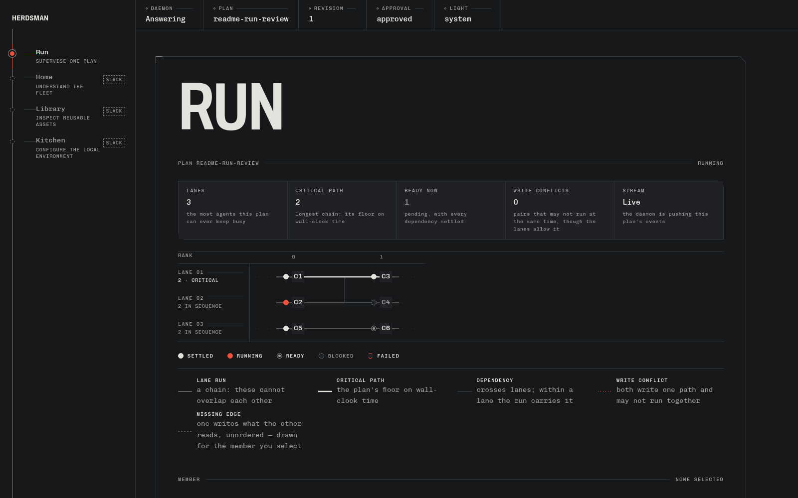
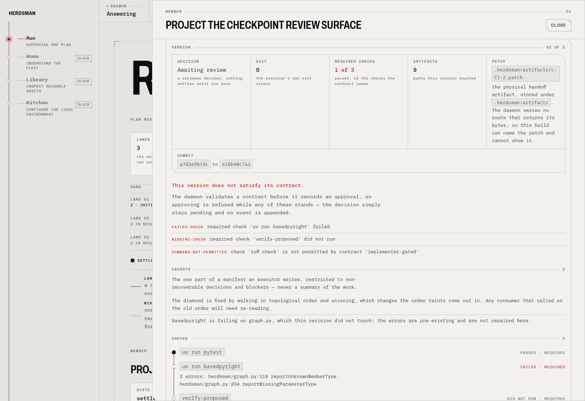

# Herdsman

**A local meta-harness for developers running multiple AI coding agent CLIs.**

Turn a brief into a dependency graph, assign work to configured harnesses and models, and supervise execution in isolated worktrees. Review checkpoint evidence before downstream work proceeds. Keep using your agent CLIs; Herdsman coordinates them rather than replacing them.

> [!NOTE]
> Herdsman is a local, pre-1.0 release. The daemon, CLI, core Run UI, project-local configuration, and recovery paths are usable; several browser views remain under active development and APIs may change.

## Run, inspect, intervene



*Run overview: parallel lanes, dependency state, and readiness.*



*Checkpoint review: inspect recorded evidence and checks before deciding a handoff. Both screenshots show the actual Svelte UI connected to `herdsman serve`, using locally seeded demo events—not a live agent run or planner-authored work.*

## What works today

- **Coordinated execution:** plan approval, concurrent dependency graphs, isolated `herdr` worktrees and panes, and checkpoint-gated artifact handoffs.
- **Operator control:** retry, restart, reassign, redirect, nudge, and pane focus. The Run UI includes the graph, initiative drawer, plan gate, checkpoint review, and initiative interventions.
- **Durable state:** project-local SQLite event history, recovery, replay, policy-bounded unattended execution, and recalibration of unfinished work.
- **Scoped context:** role contracts, task packets, evidence-backed memory, token accounting, and enforced budgets. Routine coordination does not require model calls.
- **Local configuration and assets:** Kitchen APIs for harness/model assignments; Library CLI/API for reusable roles, contracts, skills, and other assets. Bundled assets use project-local copy-on-edit overrides.
- **Offline code navigation:** `herdsman nav` generates source-linked guides, maps, and flow traces for Python repositories without a daemon or model call.
- **Scriptable operation:** stable JSON/NDJSON/text output, fleet attention and wait commands, checkpoint actions, Kitchen configuration, stdin, project discovery, ID prefixes, and shell completion.

The browser currently includes Run, Home fleet attention, Library, and Kitchen
surfaces; additional Run instruments and operator views remain under active
development. Herdsman never modifies global harness configuration.

## Install

Herdsman requires Python **3.14+**, [`uv`](https://docs.astral.sh/uv/), and the external **herdr 0.9.1** CLI (private protocol 22). Install herdr through its distribution channel, start its local server, and verify the version before installing Herdsman:

```sh
herdr --version                         # must report 0.9.1
herdr status
```

A release wheel contains the Python daemon, bundled Markdown assets, and (when built) the browser UI. From a source checkout, build the UI and then the wheel; the Python build does not install Node tooling or compile the UI:

```sh
cd ui && npm ci && npm run build && cd ..
uv build --wheel
uv tool install dist/herdsman-0.0.1-py3-none-any.whl
```

Replace the wheel filename with the one in `dist/` if the project version changes. Building without `ui/build` is supported and produces an API-only wheel; bundled Markdown assets are still included. The wheel install and UI build path are also documented in [First run](docs/first-run.md).

After project-local harness/model setup, `herdsman demo` creates the bundled three-initiative graph: D1 and D2 run in parallel, require checkpoint approval, and only then release D3. Run `herdsman demo --help` for the timeout and port options.

Read [Recovery](docs/recovery.md) before a long run and [Architecture boundaries](docs/architecture-boundaries.md) for what Herdsman, herdr, the daemon, and the browser each own.

## Try the UI from source

Requires Python **3.14+**, [`uv`](https://docs.astral.sh/uv/), and a current Node.js/npm compatible with Vite 8 (Node 22.12+). This preview needs **no agent credentials, model calls, or running herdr server**.

```sh
# Terminal 1 — from the repository root
uv sync --locked
uv run python ui/dev/seed_plan.py --shape checkpoint
uv run herdsman serve                     # http://127.0.0.1:8000
```

```sh
# Terminal 2 — from the repository root
cd ui
npm ci
npm run dev -- --host 127.0.0.1 --strictPort
```

Open **<http://127.0.0.1:5173/run?plan=ui-r4-checkpoint>**. Select an initiative to inspect its evidence; select `C1` and expand the checkpoint review to read its checks and history.

Start the daemon anywhere inside an initialized project; the CLI discovers the nearest `.herdsman/` directory. Use `-C/--project` to select one explicitly. Direct Run links use `?plan=<id>`; Home also provides fleet navigation. Seeded pane references are illustrative; runtime actions require real agents.

See the [CLI automation contract](docs/cli.md) for output, exit codes, waits, completions, and CLI/API parity. See [UI development](ui/README.md) for fixtures, capture commands, proxy configuration, and UI checks. The running daemon exposes its API documentation at <http://127.0.0.1:8000/docs>.

### Running real agents

Real execution additionally needs the pinned `herdr 0.9.1` CLI/server and authenticated agent CLIs. Start herdr, then declare adapters and model assignments in project-local `.herdsman/kitchen.json`; planning and execution can use different models on the same harness.

<details>
<summary>Example: one harness, two model assignments</summary>

Replace the placeholder model names with models available to your installed `pi` CLI. This is a configuration example, not a turnkey setup.

```json
{
  "version": 1,
  "adapters": [
    {"name": "pi", "argv": ["pi", "--print", "{prompt}"], "model_argv": ["--model"]}
  ],
  "models": [
    {"harness": "pi", "model": "frontier-model"},
    {"harness": "pi", "model": "cheap-model"}
  ],
  "tiers": {"pi/frontier-model": "frontier", "pi/cheap-model": "cheap"},
  "defaults": {
    "planner": {"harness": "pi", "model": "frontier-model"},
    "initiative": {"harness": "pi", "model": "cheap-model"}
  }
}
```

`GET /kitchen` reports configuration and readiness; `POST /kitchen/discovery` performs read-only harness health/version checks. `PUT /kitchen` requires the current `expect_revision` to prevent stale updates.

</details>

Use `herdsman create`, `review`, `approve`, and `run-plan` for the plan lifecycle; `herdsman attention`, `wait`, and `config` cover headless automation. Inspect each command's `--help` before dispatch.

## Reproduce the overhead evaluation

Run from a clean Git checkout with project-local Kitchen declarations, authenticated harness CLIs, and a live `herdr 0.9.1` server. Replace the example assignments with configured harness/model pairs; using a different second pair exercises the assignment variant.

```sh
uv run python -m herdsman.eval \
  --project-root . \
  --harness pi --model PRIMARY_MODEL \
  --assignment-harness pi --assignment-model SECOND_MODEL
```

The command runs the same tiny standard-library task as single-agent, parallel DAG, and assignment variants. It prints the exact reproduction command plus JSON containing pass rate, wall time, productive and orchestration tokens, provenance, receipt type, overhead ratio, and whether every variant met the 20% target. Only `receipt: "measured"` output from this live path is publishable; the deterministic test double is not a benchmark.

**Measured receipt:** none recorded yet. The 2026-09-19 attempt failed before producing a receipt: the reference variant's attempt did not settle, and the harness under test then exhausted its provider quota. No fixture number is substituted.

The [2026-09-20 release verification](docs/release-verification.md) records the
passing wheel smoke and the partial real demo, including the remaining global
configuration and end-to-end evidence gaps. It does not establish an eval result.

## Roadmap to v1

1. **Finish the operator UI:** recovery controls, token/budget instruments, packet inspection, recalibration, replay, memory, and code navigation; extend the shipped Run, Home, Library, and Kitchen surfaces.
2. **Complete release evidence:** multi-harness smoke tests, a real demo capture, and measured token-overhead results. The ≤20% orchestration-overhead goal is a target, not a demonstrated benchmark.

Beyond v1: in-browser asset editing, remote/cloud runtimes, broader agent protocols, and an asset registry. Local developer workflows come first.

## Development

```sh
uv run basedpyright
uv run pytest
# With the compatible herdr CLI/server available:
HERDSMAN_TEST_REAL_HERDR=1 uv run pytest -k real_herdr

# Offline, source-linked architecture guide:
uv run herdsman nav guide --refresh
uv run herdsman nav flow create-approve-run-settle
```

The generated guide lives at `.herdsman/nav/guide.md`. Navigation uses structural Python analysis, not type inference or a complete call graph.

| Path | Responsibility |
| --- | --- |
| `herdsman/` | Python CLI, daemon, domain model, and runtime adapter |
| `ui/` | SvelteKit driver UI; agents stay in terminal panes |
| `assets/` | Bundled Markdown agents, roles, and skills |
| `tests/` | Python tests, including opt-in live-herdr integration |

## License

No license has been selected. The source is publicly viewable, but no permission is granted to use, modify, or distribute it.
