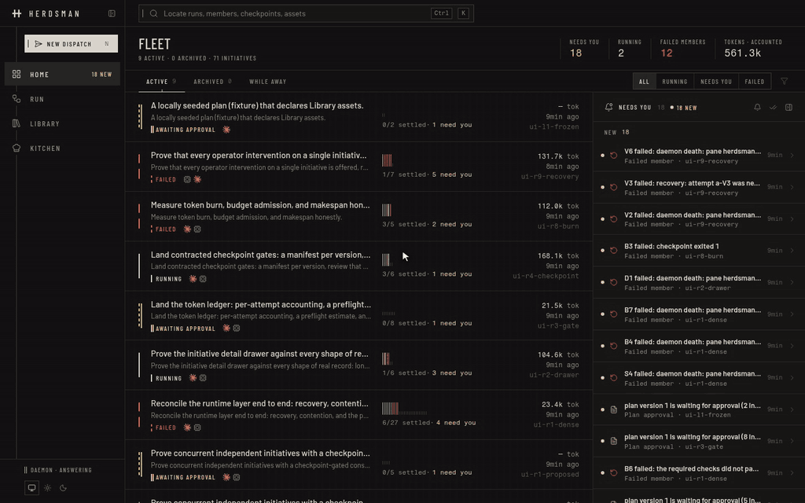
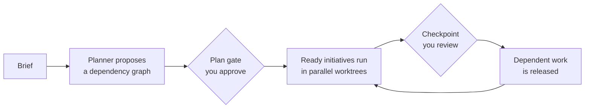

# Herdsman

**Run a team of AI coding agents from one brief, on your machine.**

   

You already have Claude Code, Codex, or pi in your terminal. One agent at a time is slow, and one frontier model on every step costs more than it needs to. Herdsman turns a brief into a dependency graph, runs the independent parts in parallel, each in its own git worktree, and sends each role to the model that suits it. Nothing moves past a checkpoint until you've approved it.

You plan, approve, and review in a browser or the CLI. The agents work in real terminal panes you can jump into at any time. Your config stays in the project; Herdsman never touches your global harness settings.

[Try it in 2 minutes](#try-it-in-2-minutes) · [Run real agents](#run-real-agents) · [What it costs](#what-orchestration-costs) · [CLI reference](docs/cli.md) · [Architecture](docs/architecture-boundaries.md)



*112 seconds through the redesigned UI, in the order you'd use it: the fleet on Home, a brief in Dispatch, Ctrl+K to a plan gate, the live Run field, the member dock with an armed Retry, Schedule, checkpoint review, Burn, Kitchen's role assignments, and Library with the memory shelf. Recorded against the real daemon with seeded plans and an example Kitchen. No live agents run in this recording, and it isn't a benchmark.*

> [!NOTE]
> Herdsman is pre-1.0 and runs locally. The daemon, the CLI, and four browser views all work today, but the APIs and workflows will keep changing. See [what's next](#whats-next).

## Why Herdsman

- **Parallel agents that don't trip over each other.** Every attempt runs in its own [herdr](#install) worktree and pane. Herdsman tracks declared write paths, so you can see when two initiatives both write `daemon.py` before they collide.
- **Cheap models for cheap work.** Send exploration to a fast, cheap model and implementation to a frontier one. On a measured task, the orchestrated run cost **22% less** than the same frontier model working alone ([details](#what-orchestration-costs)).
- **You stay in the loop at the points that matter.** You approve the plan at the gate before anything starts, and dependent work waits until you approve the checkpoint it depends on. Retry, redirect, reassign, nudge, or hold any initiative. Every write action shows what it will change and waits for you to confirm.
- **Handoffs you can audit.** Every initiative hands off through a checkpoint with versions, check results, changed paths, and downstream impact. Scouts, architects, and reviewers write to a document at a path the daemon assigns, never to model-formatted output.
- **Token spend you can see.** Inspect each task packet and what it cost, track orchestration overhead against productive work, and set a token cap. Routine coordination costs no model calls.
- **Bring your own harnesses.** Claude Code, Codex, and pi are supported today. Kitchen discovers what's installed, checks that it's ready, and maps each role to a harness and model.

## How it works


```mermaid
flowchart LR
    A[Brief] --> B[Planner proposes<br/>a dependency graph]
    B --> C{Plan gate<br/>you approve}
    C --> D[Ready initiatives run<br/>in parallel worktrees]
    D --> E{Checkpoint<br/>you review}
    E --> F[Dependent work<br/>is released]
    F --> D
```

1. **Dispatch** a brief from the UI or with `herdsman dispatch "<brief>"`. The planner starts with the smallest pipeline that fits the brief and adds roles only when it needs them.
2. **Review the plan** at the gate. You see the lanes, the critical path, write conflicts, risks, and budget before any worker starts.
3. **Run.** Ready initiatives start at the same time, each in its own worktree and terminal pane, with a task packet compiled from its role, contract, brief, and upstream patches.
4. **Approve handoffs.** Downstream initiatives wait for the approved checkpoint version of the work they depend on. If you withdraw an approval, the history stays.

## Four views of one project

| View | What you do there |
| --- | --- |
| **Home** | See every run, its progress and spend, and the *Needs you* panel of everything waiting on you. Start new work from **New dispatch**. |
| **Run** | Use the tabs for one plan: **Field** (the live graph of lanes, dependencies, and write conflicts), **Plan** (the proposal and its approval), **Schedule**, **Burn**, **Recovery**, and **Salvage**. Pick a member to open the **dock** with its overview, brief, review, diff, packet, attempts, and activity. |
| **Kitchen** | Check harness readiness, declare models, assign each role a harness and model, set fallbacks, and run an explicit smoke test. |
| **Library** | Browse roles, contracts, skills, agents, and checkpoint templates, whether bundled or project-local. Compare the live shelf with a plan's frozen set and curate the memory shelf. Edits open in your `$EDITOR`. |

The **Locate** palette (Ctrl+K) jumps to any run, member, checkpoint, or asset. Run tabs are deep-linkable (`/run?plan=…&tab=…`). The UI comes in light and dark themes and works from the keyboard: J/K moves between members, M maximizes the dock, and Esc steps back.

## Try it in 2 minutes

You need Python **3.14+**, [`uv`](https://docs.astral.sh/uv/), and Node.js **22.12+** with npm. This preview runs **without agent credentials, model calls, or a herdr server**.

```sh
git clone --branch uat https://github.com/mitaash96/herdsman.git
cd herdsman
uv sync --locked
(cd ui && npm ci && npm run build)          # source checkout only
uv run python ui/dev/seed_plan.py --shape dense
uv run herdsman serve                        # http://127.0.0.1:8000
```

Open **<http://127.0.0.1:8000/run?plan=ui-r1-dense>** to explore 27 initiatives across 16 lanes, with dependencies and file contention. Press **Ctrl+K**, type `B6`, and press Enter to jump to the failed initiative. Its dock opens with the actions you can take. Drag the dock's top edge, or press **M** to maximize it. Seeded plans are local fixtures: nothing in them was written by a planner, and their pane references are only examples.

Start the daemon anywhere inside an initialized project. The CLI finds the nearest `.herdsman/` directory, or you can pass `-C/--project`. `npm run dev` is only for hot reload while editing the UI.

## Install

Herdsman needs Python **3.14+**, [`uv`](https://docs.astral.sh/uv/), and the external **herdr 0.9.3** CLI (private protocol 22). Install herdr through its own distribution channel, start its local server, and check the version:

```sh
herdr --version                         # must report 0.9.3
herdr status
```

A release wheel includes the Python daemon, the bundled Markdown assets, and the browser UI if it was built first. From a source checkout, build the UI and then the wheel. The Python build doesn't install Node tooling or compile the UI for you:

```sh
cd ui && npm ci && npm run build && cd ..
uv build --wheel
uv tool install dist/herdsman-0.0.1-py3-none-any.whl
```

If the project version changes, use the wheel filename from `dist/`. You can build without `ui/build`; you'll get an API-only wheel that still includes the Markdown assets. [First run](docs/first-run.md) covers both paths.

After you set up harnesses and models for the project, `herdsman demo` creates the bundled three-initiative graph. D1 and D2 run in parallel and need checkpoint approval before D3 is released. Read [Recovery](docs/recovery.md) before a long run.

## Run real agents

Real runs also need the pinned `herdr 0.9.3` CLI and server, plus agent CLIs you've logged into. Start herdr, then declare adapters and model assignments in `.herdsman/kitchen.json` in your project, or set them in Kitchen. Planning and execution can use different models on the same harness.

<details>
<summary>Example: one harness, two model assignments</summary>

Replace the placeholder model names with models available to your installed `pi` CLI. This shows the shape of the file; it won't run as-is.

```json
{
  "version": 1,
  "adapters": [
    {"name": "pi", "argv": ["pi", "--print", "{prompt}"], "model_argv": ["--model"], "agent_args": []}
  ],
  "models": [
    {"harness": "pi", "model": "frontier-model"},
    {"harness": "pi", "model": "cheap-model"}
  ],
  "tiers": {"pi/frontier-model": "frontier", "pi/cheap-model": "cheap"},
  "defaults": {
    "planner": {"harness": "pi", "model": "frontier-model"},
    "initiative": {"harness": "pi", "model": "cheap-model"}
  }
}
```

Planners and executors run as interactive agents in herdr panes. herdr starts the harness TUI with `agent_args` (no `{prompt}`), and Herdsman submits a short prompt that points to a packet file written by the daemon. An attempt completes when herdr reports that the agent has settled. For Claude Code and Codex, per-launch hooks under `.herdsman/hooks/` must also confirm that the turn ended. The bounded `argv` template is only for headless calls, such as smoke checks and the planner fallback when herdr isn't available. If an agent gets stuck on a trust, login, or approval dialog, it waits for you: focus its pane to answer.

`GET /kitchen` reports configuration and readiness. `POST /kitchen/discovery` runs read-only health and version checks on each harness. `PUT /kitchen` requires the current `expect_revision`, so a stale update can't overwrite newer settings.

</details>

`herdsman dispatch "<brief>"` creates a plan from your Kitchen defaults and prints it. Add `--yes` to approve and start it in one step. For finer control, use `herdsman create`, `review`, `approve` (`--run` also starts the plan), and `run-plan`. For headless automation, use `herdsman attention`, `wait`, and `config`. The browser and the CLI call the same daemon API, and the CLI supports JSON, NDJSON, and text output, stable exit codes, briefs on stdin, and ID prefixes. See the [CLI reference](docs/cli.md).

## What orchestration costs

The same brief went to three setups: find every UI button whose explanation is printed as visible text, then move those explanations into accessible hover and focus tooltips. All three passed the UI checks. The Herdsman run was rated best, though the differences in quality were small.

| Configuration | Models | Tokens | API-equivalent cost |
| --- | --- | --- | --- |
| **Herdsman:** planner → scout → implementer | `gpt-6.1-sol` plans and implements; `deepseek-v4.1-flash` scouts | 4.21M | **$0.65** |
| Solo Claude Code | `claude-sonnet-5-5` | 1.98M | $0.81 (+24%) |
| Solo pi | `gpt-6.1-sol` | 4.39M | $0.84 (+28%) |

- **Orchestration paid for itself.** Compared with the same frontier model working alone, the orchestrated run cost 22% less and used 4% fewer tokens. Planning, the only step that is pure orchestration, used 4% of the tokens.
- **The saving comes from routing.** The scout read almost half of the run's tokens on `deepseek-v4.1-flash` for $0.04. The same exploration on `gpt-6.1-sol` would have cost about $0.67.
- **Smaller sessions re-read less.** Each role starts from its task packet instead of the whole conversation. The implementer's context peaked at 69k tokens, compared with 131k for the solo run on the same model, so each turn re-read less cached context.

These figures were measured by hand from the agents' session logs. Costs use list API prices as of 2026-10-03, although the runs themselves used subscriptions. This is one task, with one sample per setup.

<details>
<summary>Reproduce the overhead evaluation</summary>

Run this from a clean Git checkout. You need Kitchen declarations in the project, harness CLIs you've logged into, and a running `herdr 0.9.3` server. Replace the example assignments with harness/model pairs you've configured; if the second pair differs from the first, the assignment variant is exercised too.

```sh
uv run python -m herdsman.eval \
  --project-root . \
  --harness pi --model PRIMARY_MODEL \
  --assignment-harness pi --assignment-model SECOND_MODEL
```

The command runs the same small standard-library task three ways: single-agent, parallel DAG, and with assignments. It prints the exact command to reproduce the run, plus JSON with the pass rate, wall time, productive and orchestration tokens, provenance, receipt type, overhead ratio, and whether every variant met the 20% target. Only `receipt: "measured"` output from this live path is publishable; the deterministic test double is not a benchmark.

**Measured receipt:** `herdsman.eval` hasn't produced one yet. Interactive attempts don't yet import per-session usage from the harness logs, which is why the comparison above was measured by hand. No fixture number stands in for it. The [2026-09-20 release verification](docs/release-verification.md) records the passing wheel smoke test, the partial real demo, and the evidence still missing.

</details>

## What's next

- **Remaining operator flows:** fuller checkpoint content and comparison, planning in a supervised agent pane instead of a blocking call, choosing branches at dispatch, and pausing a whole run.
- **Release evidence:** a complete real multi-agent demo, a recorded check that no global config changed, and per-session usage capture from harness logs, so that Burn and `herdsman.eval` report measured spend instead of estimates.

After v1: in-browser asset editing, remote and cloud runtimes, broader agent protocols, and an asset registry. Local developer workflows come first.

## Development

```sh
uv run basedpyright
uv run pytest
# With the compatible herdr CLI/server available:
HERDSMAN_TEST_REAL_HERDR=1 uv run pytest -k real_herdr

# Offline, source-linked architecture guide:
uv run herdsman nav guide --refresh
uv run herdsman nav flow create-approve-run-settle
```

`herdsman nav` writes its guide to `.herdsman/nav/guide.md`. It uses structural Python analysis and PEP 621 entry points, labels dynamic and unresolved edges as such, and doesn't claim to be a complete, type-inferred call graph. UI checks and capture tooling are described in [ui/README.md](ui/README.md).

| Path | Responsibility |
| --- | --- |
| `herdsman/` | Python CLI, daemon, domain model, and runtime adapter |
| `ui/` | SvelteKit driver UI; agents stay in terminal panes |
| `assets/` | Bundled Markdown agents, roles, contracts, and skills |
| `tests/` | Python tests, including opt-in live-herdr integration |

## License

No license has been chosen yet. You can read the source, but you don't have permission to use, modify, or distribute it.
