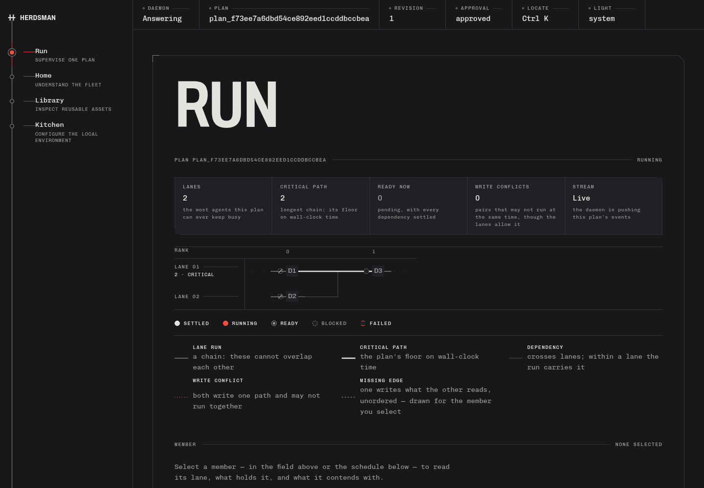

# Fresh-machine release verification — 2026-09-20

Sprint 12 is **not exit-closed**. This pass completes the multi-harness smoke and
public documentation, fixes an undeclared-harness demo failure, and prepares an
integration candidate preserving the newer F2 UI on `uat`.

## Remaining-item disposition

| Item | Result |
| --- | --- |
| R1: complete real demo and two-minute result | Open. Two real Claude producers ran concurrently and returned checkpoints in 41.33 seconds; their repository checks failed. Neither was approved, and D3 was not run. This is not a successful end-to-end timing result. |
| R2: measured reference eval | Open. No new reference eval receipt. The partial demo's token ledger is not a substitute for the public eval. Historical eval worktrees remain untouched. |
| R3: fresh-wheel multi-harness smoke | Complete. Two discovered executable harness stubs, concurrent producer subprocesses, output consumed by the second harness, and consumer blocking before and after the first approval. The scheduler and settlement are real; transport/collection are CI doubles, not live herdr or a provider benchmark. |
| R4: launch assets | Partial. README refreshed, three-node recorded-run screenshot and partial CLI recording retained below. A successful end-to-end launch recording remains open. |
| R5: public documentation | Complete. [First run](first-run.md), [recovery](recovery.md), and [architecture boundaries](architecture-boundaries.md), with single-harness setup and explicit checkpoint approvals. |
| R6: integration and closure | Candidate prepared from `uat` at `9189a1f` plus `sprint-12` at `9a46682` and this pass. Updating the repository's actual branch refs is blocked by read-only Git metadata. The owner's comprehension interview remains open. |

## Evidence and limits

The screenshot uses the existing Run UI from the merged candidate and a SQLite
backup of the real run, taken after its producers were cancelled during cleanup.
D3 remains blocked. It is not a seeded success or a completed demo.

[Partial terminal recording](evidence/demo-producers-partial.cast) is an
asciinema v2 recording of the CLI's returned graph after 41.33 seconds. The CLI
prints at completion, so it does not show live pane activity. It records the
partial run faithfully and is diagnostic evidence, not the final launch demo.

Plan: `plan_f73ee7a6dbd54ce892eed1ccddbccbea`. Two `attempt_started` events and
two `checkpoint_recorded` events exist; producer checks failed and no checkpoint
approval was given. The test environment initially routed worktrees outside the
writable sandbox. A separate herdr instance with its worktree directory under
`/tmp` removed that filesystem restriction. The real attempt's repository tests
then failed; this pass subsequently corrected test isolation, but did not launch
another Claude run.

Before/after hashes of `~/.claude.json` differed during this verification window;
`~/.claude/settings.json` and herdr's global `config.toml` hashes were unchanged.
No permission-bypass flag was used, and no global configuration was intentionally
edited or restored. Concurrent activity was not excluded, so these observations
do not establish which process changed the file. They do mean the strict
no-global-change exit criterion cannot be certified by this run. Further live
provider verification needs an isolated harness state directory and an explicit
check of that harness's supported authentication/setup path.

## Changes made during verification

- `demo` validates its local harness before creating a plan; a fresh undeclared
  default now gives an error instead of returning a graph with no admitted work.
- The wheel smoke anchors its nested project before `init`, preventing upward
  discovery from selecting the surrounding checkout.
- CLI/lifecycle unit tests isolate the chosen cwd from ancestor project records.
  Discovery still has its own integration coverage. Config tests anchor their
  temporary projects; completion testing selects a deterministic detected shell.
- The first-run guide treats `up` as a foreground server and explains review,
  both producer approvals, and resuming D3 in another terminal.

## Future UI-dependent work (skipped in this pass)

- K2/K3: browser harness setup and model/assignment configuration. Use project-local
  CLI configuration for first-run instructions until these surfaces exist.
- H4: browser Dispatch/onboarding flow; first-run instructions use the CLI.
- R9: recovery and plan lifecycle controls in the browser; recovery is documented
  through the CLI.
- R4/R5: complete version-bound handoff content and exact diff review. Existing
  checkpoint metadata is usable, but launch material must not imply these missing
  views are delivered.
- R7/R8 and R12–R14: packet inspection, token instruments, replay, and code
  navigation visual coverage when those views are built. Existing checks cover
  delivered UI only.

These deferrals do not block CLI smoke coverage or the public eval. They are
separate from the open provider/configuration evidence and owner interview.

## Validation

Root owned the final aggregate gate in the clean integration checkout:

- `uv run basedpyright`: 0 errors, 0 warnings.
- `uv run pytest`: 609 passed, 4 skipped (the opt-in live-herdr cases).
- `HERDSMAN_TEST_REAL_HERDR=1 uv run pytest -k real_herdr`: 4 passed,
  using the isolated herdr server and writable worktree directory.
- `npm run check`: 0 errors/warnings; `npm run build`,
  `node dev/field-check.ts`, and `node dev/a11y-check.ts`: passed on the
  candidate including F2.
- Built the real UI-bearing wheel, installed it in a bare Python 3.14 venv,
  and executed the complete fresh-machine workflow shell block: passed.
- Documentation local links and `git diff --check`: passed.

The final test fixes do not alter the live adapter, scheduler, or UI. Earlier
failed/interrupted aggregate attempts were investigated; only the final completed
pass above is release evidence.

The isolated demo's two attempts were cancelled, their worktrees discarded, and
its attempt branches removed. The first trial's `w30`/`w41` worktrees under the
normal global herdr directory remain retained, as do the two historical eval
worktrees: this session cannot write those paths. Their source checkout is
`/tmp/herdsman-live-verify`, and the captured initial-runtime event history is
retained under `/tmp/herdsman-live-artifacts/teardown/initial-runtime`. Cleanup of
these specific owned trial resources remains an operational follow-up; unrelated
plans and worktrees must be preserved.
